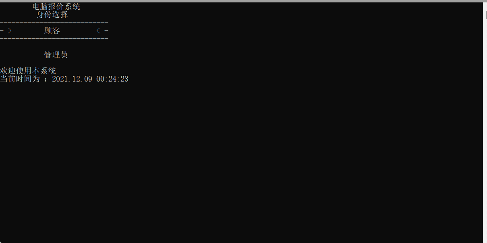

# Computerized_quotation_system

### 简介：

项目名称：电脑报价系统

项目功能：使用C语言以及"黑框框"实现一个类似网购选择系统

项目起因：大一学年，寒假期间的假期项目

完成时间：2020年2月

自我评价：代码是屎山 ，但是不得不服我自己，居然能一口气写出来三四千行的C语言代码（2021/12）

### 使用方法

* 利用键盘操作 W S Q E
  * E为进入菜单键
  * Q为返回键
  * W S为上下选择
  * 部分界面的操作方式会有说明
  * 注意操作时一定要调整为大写锁定

### 提醒：

* 管理员账户：

  * 账户名：admin（小写）
  * 密码：123456

  

### 程序功能导图

### 提醒

* 本程序不兼容windows以外的系统

### 其他说明

* 程序必须与data在一个目录 否则会导致文件打开失败
* data目录下#开头的文件为数据文件 后缀为Ac 可用文本打开 修改后不要保存 可能会因编码问题导致程序内读取的字符乱码
* account文件是储存账号及密码的文件，我将admin的密码隐藏在了pi 里面（我为什么会这样想 ， 阿巴阿巴阿巴）
* first.Ac储存文件欢迎界面的字符画

* Computerized_quotation_system.cpp为程序源代码
* 电脑报价系统.exe 为程序可执行文件，可以直接运行

### 演示

